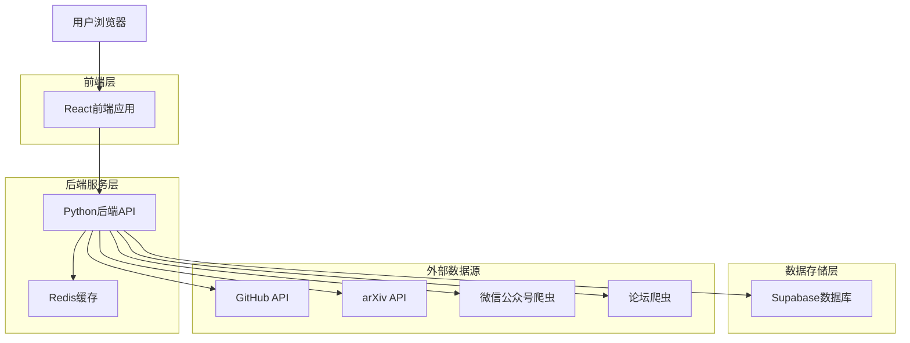
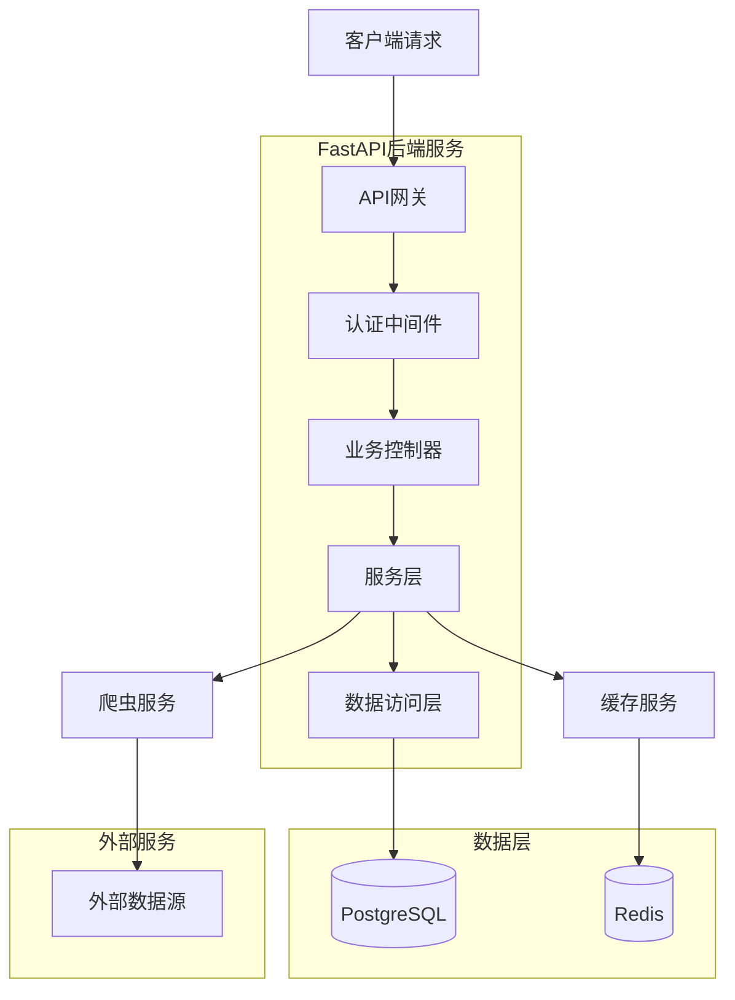
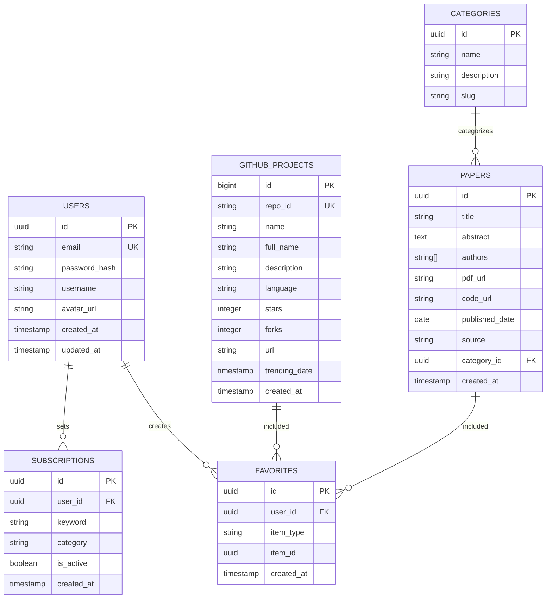

## 1. 架构设计



## 2. 技术描述

- **前端**: React@18 + TypeScript@5 + Tailwind CSS@3 + Vite
- **初始化工具**: vite-init
- **后端**: Python@3.11 + FastAPI@0.104
- **数据库**: Supabase (PostgreSQL@15)
- **缓存**: Redis@7
- **爬虫框架**: Scrapy@2.11 + BeautifulSoup@4.12
- **任务调度**: Celery@5.3 + Redis Broker

## 3. 路由定义

| 路由 | 用途 |
|-------|---------|
| / | 首页，展示热点项目和推荐论文 |
| /github | GitHub热点项目列表页面 |
| /papers | 计算机视觉论文列表页面 |
| /paper/:id | 论文详情页面 |
| /project/:id | 项目详情页面 |
| /profile | 用户个人中心 |
| /favorites | 用户收藏管理页面 |
| /api/auth/* | 用户认证相关API |
| /api/github/* | GitHub数据相关API |
| /api/papers/* | 论文数据相关API |

## 4. API定义

### 4.1 核心API

**获取GitHub热点项目**
```
GET /api/github/trending
```

请求参数：
| 参数名 | 参数类型 | 是否必需 | 描述 |
|-----------|-------------|-------------|-------------|
| language | string | false | 编程语言筛选 |
| since | string | false | 时间范围（daily/weekly/monthly） |
| page | number | false | 页码，默认1 |
| limit | number | false | 每页数量，默认20 |

响应示例：
```json
{
  "data": [
    {
      "id": 123456,
      "name": "awesome-project",
      "full_name": "user/awesome-project",
      "description": "An awesome project description",
      "stars": 15420,
      "language": "Python",
      "url": "https://github.com/user/awesome-project",
      "trending_date": "2026-01-31"
    }
  ],
  "total": 100,
  "page": 1
}
```

**获取CV论文列表**
```
GET /api/papers/latest
```

请求参数：
| 参数名 | 参数类型 | 是否必需 | 描述 |
|-----------|-------------|-------------|-------------|
| category | string | false | CV子领域分类 |
| source | string | false | 来源筛选（arxiv/公众号/论坛） |
| page | number | false | 页码，默认1 |
| limit | number | false | 每页数量，默认20 |

响应示例：
```json
{
  "data": [
    {
      "id": "paper-123",
      "title": "Advanced Computer Vision Techniques",
      "authors": ["Zhang San", "Li Si"],
      "abstract": "This paper presents...",
      "published_date": "2026-01-30",
      "pdf_url": "https://arxiv.org/pdf/1234.5678.pdf",
      "code_url": "https://github.com/user/cv-paper",
      "source": "arxiv"
    }
  ],
  "total": 50,
  "page": 1
}
```

**用户收藏操作**
```
POST /api/user/favorite
```

请求体：
| 参数名 | 参数类型 | 是否必需 | 描述 |
|-----------|-------------|-------------|-------------|
| type | string | true | 收藏类型（project/paper） |
| item_id | string | true | 项目或论文ID |
| action | string | true | 操作类型（add/remove） |

## 5. 服务器架构图



## 6. 数据模型

### 6.1 数据模型定义



### 6.2 数据定义语言

**用户表 (users)**
```sql
-- 创建用户表
CREATE TABLE users (
    id UUID PRIMARY KEY DEFAULT gen_random_uuid(),
    email VARCHAR(255) UNIQUE NOT NULL,
    password_hash VARCHAR(255) NOT NULL,
    username VARCHAR(50) UNIQUE NOT NULL,
    avatar_url TEXT,
    created_at TIMESTAMP WITH TIME ZONE DEFAULT NOW(),
    updated_at TIMESTAMP WITH TIME ZONE DEFAULT NOW()
);

-- 创建索引
CREATE INDEX idx_users_email ON users(email);
CREATE INDEX idx_users_username ON users(username);
```

**GitHub项目表 (github_projects)**
```sql
-- 创建GitHub项目表
CREATE TABLE github_projects (
    id BIGSERIAL PRIMARY KEY,
    repo_id VARCHAR(100) UNIQUE NOT NULL,
    name VARCHAR(255) NOT NULL,
    full_name VARCHAR(255) NOT NULL,
    description TEXT,
    language VARCHAR(50),
    stars INTEGER DEFAULT 0,
    forks INTEGER DEFAULT 0,
    url TEXT NOT NULL,
    trending_date DATE NOT NULL,
    created_at TIMESTAMP WITH TIME ZONE DEFAULT NOW()
);

-- 创建索引
CREATE INDEX idx_github_trending ON github_projects(trending_date DESC);
CREATE INDEX idx_github_language ON github_projects(language);
CREATE INDEX idx_github_stars ON github_projects(stars DESC);
```

**论文表 (papers)**
```sql
-- 创建论文表
CREATE TABLE papers (
    id UUID PRIMARY KEY DEFAULT gen_random_uuid(),
    title VARCHAR(500) NOT NULL,
    abstract TEXT NOT NULL,
    authors TEXT[] NOT NULL,
    pdf_url TEXT,
    code_url TEXT,
    published_date DATE NOT NULL,
    source VARCHAR(50) NOT NULL,
    category_id UUID REFERENCES categories(id),
    created_at TIMESTAMP WITH TIME ZONE DEFAULT NOW()
);

-- 创建索引
CREATE INDEX idx_papers_date ON papers(published_date DESC);
CREATE INDEX idx_papers_category ON papers(category_id);
CREATE INDEX idx_papers_source ON papers(source);
```

**收藏表 (favorites)**
```sql
-- 创建收藏表
CREATE TABLE favorites (
    id UUID PRIMARY KEY DEFAULT gen_random_uuid(),
    user_id UUID REFERENCES users(id) ON DELETE CASCADE,
    item_type VARCHAR(20) NOT NULL CHECK (item_type IN ('project', 'paper')),
    item_id UUID NOT NULL,
    created_at TIMESTAMP WITH TIME ZONE DEFAULT NOW(),
    UNIQUE(user_id, item_type, item_id)
);

-- 创建索引
CREATE INDEX idx_favorites_user ON favorites(user_id);
CREATE INDEX idx_favorites_type ON favorites(item_type);
```

**Supabase权限设置**
```sql
-- 授予匿名用户基本读取权限
GRANT SELECT ON github_projects TO anon;
GRANT SELECT ON papers TO anon;
GRANT SELECT ON categories TO anon;

-- 授予认证用户完整权限
GRANT ALL PRIVILEGES ON users TO authenticated;
GRANT ALL PRIVILEGES ON favorites TO authenticated;
GRANT ALL PRIVILEGES ON subscriptions TO authenticated;
```