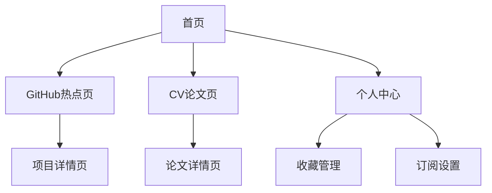

## 1. 产品概述
TechVision是一个技术内容聚合平台，专注于展示GitHub热点项目和计算机视觉领域最新论文。该平台帮助开发者和技术人员快速发现热门开源项目和前沿研究成果，节省信息搜集时间，提升技术视野。

目标用户：软件开发者、AI研究者、技术爱好者、计算机视觉从业者。

## 2. 核心功能

### 2.1 用户角色
| 角色 | 注册方式 | 核心权限 |
|------|----------|----------|
| 访客用户 | 无需注册 | 浏览GitHub热点项目、查看CV论文列表 |
| 注册用户 | 邮箱注册 | 收藏项目、订阅关键词、接收更新通知 |
| 管理员 | 后台创建 | 管理内容源、审核用户反馈、系统配置 |

### 2.2 功能模块
TechVision网站包含以下主要页面：
1. **首页**：GitHub热点项目轮播、CV论文推荐、搜索功能。
2. **GitHub热点页**：项目列表、筛选排序、项目详情展示。
3. **CV论文页**：论文列表、分类浏览、论文详情和PDF链接。
4. **个人中心**：收藏管理、订阅设置、浏览历史。

### 2.3 页面详情
| 页面名称 | 模块名称 | 功能描述 |
|-----------|-------------|---------------------|
| 首页 | 热点轮播 | 自动轮播展示当日最热门的GitHub项目和重要CV论文。 |
| 首页 | 快速搜索 | 支持按关键词搜索项目和论文，实时显示搜索结果。 |
| 首页 | 分类导航 | 提供GitHub和论文两个主要入口的快速导航按钮。 |
| GitHub热点页 | 项目列表 | 展示项目名称、star数、语言、简介等核心信息。 |
| GitHub热点页 | 筛选排序 | 支持按语言、时间范围、star增长率等条件筛选排序。 |
| GitHub热点页 | 项目详情 | 显示项目README摘要、贡献者信息、相关链接。 |
| CV论文页 | 论文列表 | 展示论文标题、作者、摘要、发表时间和来源。 |
| CV论文页 | 分类浏览 | 按计算机视觉子领域（检测、分割、识别等）分类展示。 |
| CV论文页 | 论文详情 | 显示完整摘要、作者信息、PDF链接和代码链接。 |
| 个人中心 | 收藏管理 | 管理用户收藏的项目和论文，支持分类整理。 |
| 个人中心 | 订阅设置 | 设置关键词订阅，接收相关内容更新通知。 |
| 个人中心 | 浏览历史 | 查看历史浏览记录，支持清空和导出功能。 |

## 3. 核心流程
用户操作流程：
1. 访客用户访问首页，浏览推荐的GitHub项目和CV论文。
2. 点击GitHub热点进入项目列表页，可按条件筛选感兴趣的项目。
3. 点击具体项目查看详细信息，注册用户可选择收藏。
4. 切换到CV论文页面，浏览最新发表的计算机视觉论文。
5. 注册用户可在个人中心管理收藏和订阅偏好。

页面导航流程：

## 4. 用户界面设计

### 4.1 设计风格
- **主色调**：深蓝色(#1e3a8a)搭配白色背景，突出科技感
- **辅助色**：亮蓝色(#3b82f6)用于按钮和链接，灰色(#6b7280)用于次要文字
- **按钮样式**：圆角矩形设计，hover时有轻微阴影效果
- **字体选择**：中文使用思源黑体，英文使用Inter，标题18-24px，正文14-16px
- **布局风格**：卡片式布局，顶部固定导航栏，响应式网格系统
- **图标风格**：使用简洁的线性图标，保持视觉一致性

### 4.2 页面设计概述
| 页面名称 | 模块名称 | UI元素 |
|-----------|-------------|-------------|
| 首页 | 热点轮播 | 全宽轮播图，自动切换间隔5秒，包含项目截图和标题叠加层。 |
| 首页 | 搜索框 | 居中放置的圆角搜索框，宽度60%，带搜索图标和清除按钮。 |
| GitHub热点页 | 项目卡片 | 网格布局，每行3-4个卡片，包含项目图标、名称、star数、语言标签。 |
| CV论文页 | 论文列表 | 简洁的列表布局，每篇论文占据一行，包含标题、作者、发表时间。 |
| 个人中心 | 收藏夹 | 标签页切换设计，左侧显示分类，右侧显示对应内容列表。 |

### 4.3 响应式设计
采用桌面优先设计策略：
- 桌面端：1200px以上宽度，完整展示所有功能和内容
- 平板端：768px-1199px，适当调整布局密度和卡片大小
- 移动端：低于768px，采用单列布局，隐藏非核心功能
- 触摸优化：按钮最小点击区域44px，支持手势滑动切换

### 4.4 数据可视化
- GitHub项目趋势图：使用折线图展示star增长趋势
- 论文发表统计：柱状图显示各会议论文数量分布
- 关键词云图：展示当前热门技术关键词
- 交互提示：鼠标悬停显示详细数据，支持点击查看详情